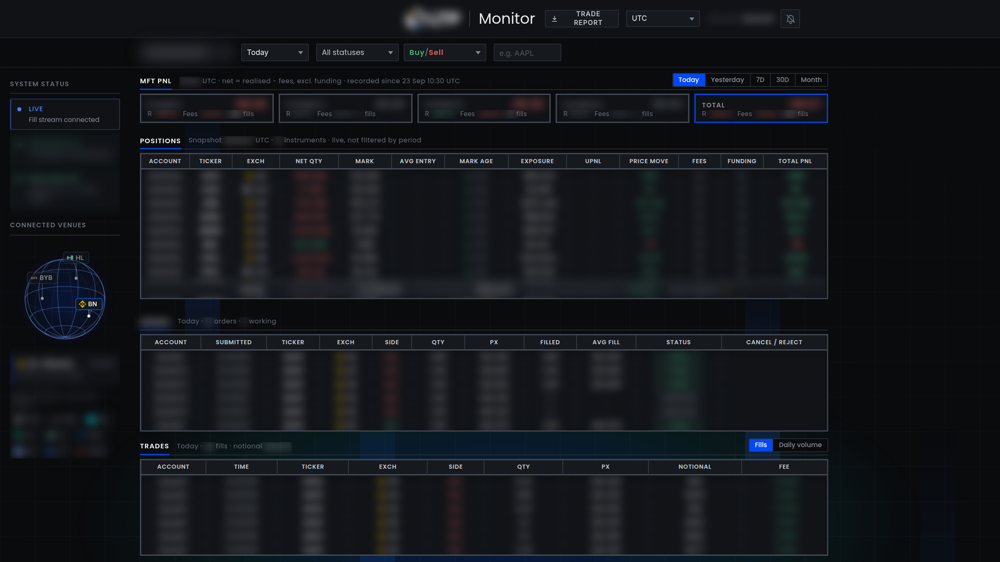

# Trading Monitor

Internal web terminal I built for our trading desk to follow orders, fills, positions and P&L in real time. It's read-only, so nobody has to query the database to see what the strategies did.

Account names, tickers, sizes, prices and P&L are blurred.

## Features

- Order blotter with a timeline for each order (submitted, partially filled, filled, cancelled, rejected)
- Reconciliation against the OMS, with an alert when the two disagree
- Fills and daily volume by account, venue and side, with filters and UTC/local time
- Live positions with mark price, mark age (stale marks flagged), exposure, fees, funding, P&L and gross/net totals
- P&L per strategy for today, yesterday, 7D, 30D and month, saved daily
- Trade reports exported to PDF, Word or CSV
- Health panel for the fill stream, OMS match and data feeds

## Stack

Python backend reading the firm's tick store (ArcticDB on S3) and the OMS snapshot, with a plain JavaScript frontend. It runs as a systemd service and is only reachable through an SSH tunnel. 130+ tests run on captured real data, and Playwright checks the layout at six screen sizes.

## Data audit

Before trusting the numbers I checked every fill against the raw exchange data. That turned up around 2,700 orders that weren't showing, fills landing on the wrong day, and stale orders the OMS had already settled. All of those are fixed. It also showed a gap in an upstream fill feed, which I reported.

Code is proprietary. More of my work: [work-portfolio](https://github.com/mjaun556-svg/work-portfolio)
